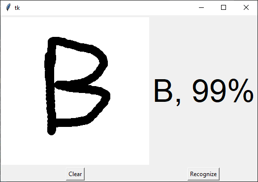

# Handwritten Character Recognition with Neural Network

To make machines more intelligent, the developers are diving into machine 
learning and deep learning techniques. A human learns to perform a task by 
practicing and repeating it again and again so that it memorizes how to 
perform the tasks. Then the neurons in his brain automatically trigger and 
they can quickly perform the task they have learned. Deep learning is also 
very similar to this. It uses different types of neural network 
architectures for different types of problems. For example – object 
recognition, image and sound classification, object detection, image 
segmentation, etc.

## About the project

In this machine learning project, we will recognize handwritten characters, 
i.e, English alphabets from A-Z. This we are going to achieve by modeling a 
neural network that will have to be trained over a dataset containing images 
of alphabets.

### The dataset

The dataset is available [here](https://www.kaggle.com/sachinpatel21/az-handwritten-alphabets-in-csv-format/download)

## Prerequisite

Below are the prerequisites for this project:

    Python (3.9.0 used)
    IDE (Pycharm used)

Required frameworks are

    Numpy (version 1.19.2)
    cv2 (openCV) (version 4.5.1.48)
    Tensorflow (version 2.5.0rc1)
    Matplotlib (version 3.4.0)
    Pandas (version 1.2.4)

## Project Plan

- [x] Code the model
- [x] Adapt digit GUI to alpha
- [x] Test both digit and alpha
