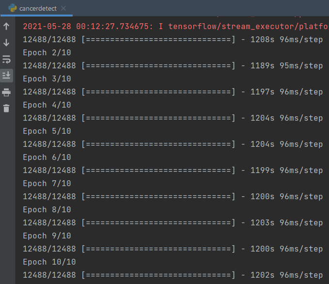

# Breast Cancer Classification with Deep Learning

The goal of this project is to build a breast cancer classifier on an IDC 
dataset that can accurately classify a histology image as benign or malignant.

## About the project

In this project in python, we built a classifier to train on 80% of a 
breast cancer histology image dataset. Of this, we’ll keep 10% of the data 
for validation. Using Keras, we’ll define a CNN (Convolutional Neural 
Network), call it cancerdetect, and train it on our images. We’ll then derive a 
confusion matrix to analyze the performance of the model.

IDC is Invasive Ductal Carcinoma; cancer that develops in a milk duct and 
invades the fibrous or fatty breast tissue outside the duct; it is the most 
common form of breast cancer forming 80% of all breast cancer diagnoses. And 
histology is the study of the microscopic structure of tissues.

### The Dataset

We use the IDC_regular dataset (the breast cancer histology image dataset)
from Kaggle. This dataset holds 2,77,524 patches of size 50×50 extracted 
from 162 whole mount slide images of breast cancer specimens scanned at 40x. 
Of these, 1,98,738 test negative and 78,786 test positive with IDC. The 
dataset is available in public domain and we 
[download it here](https://www.kaggle.com/paultimothymooney/breast-histopathology-images/). 
We need a minimum of 3.02GB of disk space for this.

Filenames in this dataset look like this:

8863_idx5_x451_y1451_class0

Here, 8863_idx5 is the patient ID, 451 and 1451 are the x- and y- 
coordinates of the crop, and 0 is the class label (0 denotes absence of IDC).

## Prerequisite

Here are the library needed for the project:

    numpy 
    opencv-python 
    pillow 
    tensorflow 
    keras 
    imutils 
    scikit-learn 
    matplotlib

## Project Plan

- [ ] Download the dataset
- [ ] Create the configurations
- [ ] Build the dataset
- [ ] Create the model
- [ ] Train the model
