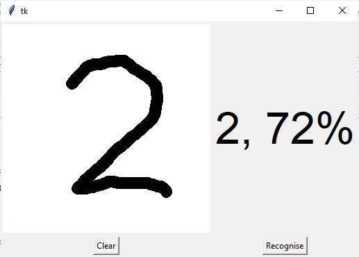
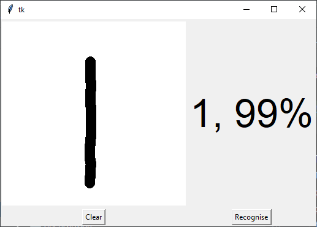
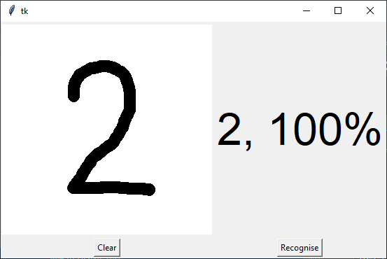

# Handwritten Digit Recognition using Python

...

To make machines more intelligent, the developers are diving into machine 
learning and deep learning techniques. A human learns to perform a task by 
practicing and repeating it again and again so that it memorizes how to 
perform the tasks. Then the neurons in his brain automatically trigger and 
they can quickly perform the task they have learned. Deep learning is also 
very similar to this. It uses different types of neural network 
architectures for different types of problems. For example – object 
recognition, image and sound classification, object detection, image 
segmentation, etc.

## About the project

The handwritten digit recognition is the ability of computers to recognize 
human handwritten digits. It is a hard task for the machine because 
handwritten digits are not perfect and can be made with many different 
flavors. The handwritten digit recognition is the solution to this problem 
which uses the image of a digit and recognizes the digit present in the image.

## Prerequisite

The interesting Python project requires you to have basic knowledge of 
Python programming, deep learning with Keras library and the Tkinter library 
for building GUI.

We need to install those necessary libraries for this project:
- Numpy - for data processing
- TensorFlow - for NN modeling
- Keras - for DNN modeling
- Pillow - Image processing

using this command:
    pip install numpy, tensorflow, keras, pillow,

## Project Plan

- [x] Import the code
- [x] Correct error
- [x] Fine tune the model

## Training

    python.exe -m digitrecog.__main__
    2021-05-07 12:39:46.561691: I tensorflow/stream_executor/platform/default/dso_loader.cc:49] Successfully opened dynamic library cudart64_110.dll
    (60000, 28, 28) (60000,)
    x_train shape: (60000, 28, 28, 1)
    60000 train samples
    10000 test samples
    2021-05-07 12:39:51.004149: I tensorflow/stream_executor/platform/default/dso_loader.cc:49] Successfully opened dynamic library nvcuda.dll
    2021-05-07 12:39:51.439667: I tensorflow/core/common_runtime/gpu/gpu_device.cc:1733] Found device 0 with properties: 
    pciBusID: 0000:01:00.0 name: NVIDIA GeForce 940MX computeCapability: 5.0
    coreClock: 1.2415GHz coreCount: 3 deviceMemorySize: 2.00GiB deviceMemoryBandwidth: 13.41GiB/s
    2021-05-07 12:39:51.440120: I tensorflow/stream_executor/platform/default/dso_loader.cc:49] Successfully opened dynamic library cudart64_110.dll
    2021-05-07 12:39:51.449382: I tensorflow/stream_executor/platform/default/dso_loader.cc:49] Successfully opened dynamic library cublas64_11.dll
    2021-05-07 12:39:51.449611: I tensorflow/stream_executor/platform/default/dso_loader.cc:49] Successfully opened dynamic library cublasLt64_11.dll
    2021-05-07 12:39:51.454432: I tensorflow/stream_executor/platform/default/dso_loader.cc:49] Successfully opened dynamic library cufft64_10.dll
    2021-05-07 12:39:51.456213: I tensorflow/stream_executor/platform/default/dso_loader.cc:49] Successfully opened dynamic library curand64_10.dll
    2021-05-07 12:39:51.460356: I tensorflow/stream_executor/platform/default/dso_loader.cc:49] Successfully opened dynamic library cusolver64_11.dll
    2021-05-07 12:39:51.464956: I tensorflow/stream_executor/platform/default/dso_loader.cc:49] Successfully opened dynamic library cusparse64_11.dll
    2021-05-07 12:39:51.467150: I tensorflow/stream_executor/platform/default/dso_loader.cc:49] Successfully opened dynamic library cudnn64_8.dll
    2021-05-07 12:39:51.467468: I tensorflow/core/common_runtime/gpu/gpu_device.cc:1871] Adding visible gpu devices: 0
    2021-05-07 12:39:51.468607: I tensorflow/core/platform/cpu_feature_guard.cc:142] This TensorFlow binary is optimized with oneAPI Deep Neural Network Library (oneDNN) to use the following CPU instructions in performance-critical operations:  AVX AVX2
    To enable them in other operations, rebuild TensorFlow with the appropriate compiler flags.
    2021-05-07 12:39:51.470148: I tensorflow/core/common_runtime/gpu/gpu_device.cc:1733] Found device 0 with properties: 
    pciBusID: 0000:01:00.0 name: NVIDIA GeForce 940MX computeCapability: 5.0
    coreClock: 1.2415GHz coreCount: 3 deviceMemorySize: 2.00GiB deviceMemoryBandwidth: 13.41GiB/s
    2021-05-07 12:39:51.470973: I tensorflow/core/common_runtime/gpu/gpu_device.cc:1871] Adding visible gpu devices: 0
    2021-05-07 12:39:52.239172: I tensorflow/core/common_runtime/gpu/gpu_device.cc:1258] Device interconnect StreamExecutor with strength 1 edge matrix:
    2021-05-07 12:39:52.239480: I tensorflow/core/common_runtime/gpu/gpu_device.cc:1264]      0 
    2021-05-07 12:39:52.239663: I tensorflow/core/common_runtime/gpu/gpu_device.cc:1277] 0:   N 
    2021-05-07 12:39:52.240111: I tensorflow/core/common_runtime/gpu/gpu_device.cc:1418] Created TensorFlow device (/job:localhost/replica:0/task:0/device:GPU:0 with 1359 MB memory) -> physical GPU (device: 0, name: NVIDIA GeForce 940MX, pci bus id: 0000:01:00.0, compute capability: 5.0)
    2021-05-07 12:39:52.914746: I tensorflow/compiler/mlir/mlir_graph_optimization_pass.cc:176] None of the MLIR Optimization Passes are enabled (registered 2)
    Epoch 1/16
    WARNING:tensorflow:AutoGraph could not transform <bound method Dense.call of <keras.layers.core.Dense object at 0x0000024D1877C7F0>> and will run it as-is.
    Please report this to the TensorFlow team. When filing the bug, set the verbosity to 10 (on Linux, `export AUTOGRAPH_VERBOSITY=10`) and attach the full output.
    Cause: invalid syntax (tmphr9ir1pi.py, line 48)
    To silence this warning, decorate the function with @tf.autograph.experimental.do_not_convert
    2021-05-07 12:40:08.346166: I tensorflow/stream_executor/platform/default/dso_loader.cc:49] Successfully opened dynamic library cudnn64_8.dll
    2021-05-07 12:40:08.784434: I tensorflow/stream_executor/cuda/cuda_dnn.cc:359] Loaded cuDNN version 8200
    2021-05-07 12:40:09.336100: I tensorflow/stream_executor/platform/default/dso_loader.cc:49] Successfully opened dynamic library cublas64_11.dll
    2021-05-07 12:40:09.900036: I tensorflow/stream_executor/platform/default/dso_loader.cc:49] Successfully opened dynamic library cublasLt64_11.dll
    938/938 [==============================] - 27s 10ms/step - loss: 0.5524 - accuracy: 0.8313 - val_loss: 0.0691 - val_accuracy: 0.9785
    Epoch 2/16
    938/938 [==============================] - 8s 9ms/step - loss: 0.0755 - accuracy: 0.9778 - val_loss: 0.0491 - val_accuracy: 0.9848
    Epoch 3/16
    938/938 [==============================] - 9s 9ms/step - loss: 0.0540 - accuracy: 0.9831 - val_loss: 0.0534 - val_accuracy: 0.9833
    Epoch 4/16
    938/938 [==============================] - 9s 9ms/step - loss: 0.0358 - accuracy: 0.9892 - val_loss: 0.0401 - val_accuracy: 0.9873
    Epoch 5/16
    938/938 [==============================] - 9s 9ms/step - loss: 0.0295 - accuracy: 0.9904 - val_loss: 0.0380 - val_accuracy: 0.9882
    Epoch 6/16
    938/938 [==============================] - 8s 8ms/step - loss: 0.0231 - accuracy: 0.9924 - val_loss: 0.0369 - val_accuracy: 0.9888
    Epoch 7/16
    938/938 [==============================] - 8s 8ms/step - loss: 0.0206 - accuracy: 0.9929 - val_loss: 0.0365 - val_accuracy: 0.9900
    Epoch 8/16
    938/938 [==============================] - 8s 8ms/step - loss: 0.0172 - accuracy: 0.9944 - val_loss: 0.0374 - val_accuracy: 0.9881
    Epoch 9/16
    938/938 [==============================] - 8s 8ms/step - loss: 0.0178 - accuracy: 0.9941 - val_loss: 0.0401 - val_accuracy: 0.9885
    Epoch 10/16
    938/938 [==============================] - 8s 8ms/step - loss: 0.0072 - accuracy: 0.9979 - val_loss: 0.0325 - val_accuracy: 0.9918
    Epoch 11/16
    938/938 [==============================] - 8s 8ms/step - loss: 0.0055 - accuracy: 0.9986 - val_loss: 0.0319 - val_accuracy: 0.9919
    Epoch 12/16
    938/938 [==============================] - 8s 8ms/step - loss: 0.0035 - accuracy: 0.9993 - val_loss: 0.0324 - val_accuracy: 0.9922
    Epoch 13/16
    938/938 [==============================] - 8s 8ms/step - loss: 0.0028 - accuracy: 0.9994 - val_loss: 0.0346 - val_accuracy: 0.9921
    Epoch 14/16
    938/938 [==============================] - 8s 8ms/step - loss: 0.0024 - accuracy: 0.9996 - val_loss: 0.0346 - val_accuracy: 0.9920
    Epoch 15/16
    938/938 [==============================] - 8s 8ms/step - loss: 0.0018 - accuracy: 0.9997 - val_loss: 0.0357 - val_accuracy: 0.9920
    Epoch 16/16
    938/938 [==============================] - 8s 8ms/step - loss: 0.0016 - accuracy: 0.9997 - val_loss: 0.0353 - val_accuracy: 0.9920
    The model has successfully trained
    Saving the model as mnist16.h5
    Test loss: 0.03529025614261627
    Test accuracy: 0.9919999837875366
