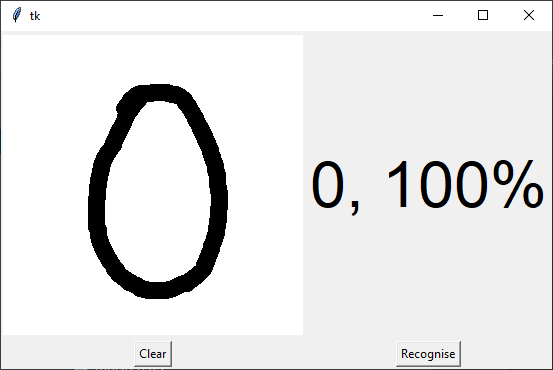

# Handwritten Digit Recognition using Python

To make machines more intelligent, the developers are diving into machine 
learning and deep learning techniques. A human learns to perform a task by 
practicing and repeating it again and again so that it memorizes how to 
perform the tasks. Then the neurons in his brain automatically trigger and 
they can quickly perform the task they have learned. Deep learning is also 
very similar to this. It uses different types of neural network 
architectures for different types of problems. For example – object 
recognition, image and sound classification, object detection, image 
segmentation, etc.

## About the project

The handwritten digit recognition is the ability of computers to recognize 
human handwritten digits. It is a hard task for the machine because 
handwritten digits are not perfect and can be made with many different 
flavors. The handwritten digit recognition is the solution to this problem 
which uses the image of a digit and recognizes the digit present in the image.

## Prerequisite

The interesting Python project requires you to have basic knowledge of 
Python programming, deep learning with Keras library and the Tkinter library 
for building GUI.

We need to install those necessary libraries for this project:
- Numpy - for data processing
- TensorFlow - for NN modeling
- Keras - for DNN modeling
- Pillow - Image processing

using this command:
    pip install numpy, tensorflow, keras, pillow,

## Project Plan

- [x] Import the code
- [x] Correct error
- [x] Fine tune the model
