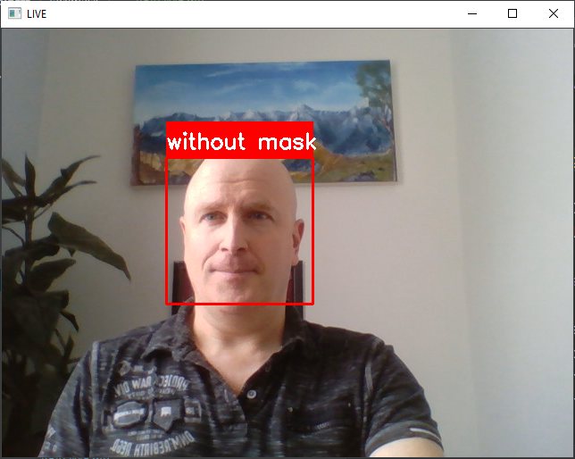
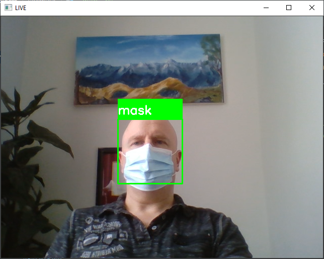

# Real-time Face Mask Detector with Python.

During pandemic COVID-19, WHO has made wearing masks compulsory to protect 
against this deadly virus. We have made an app detecting if we are wearing
one or not.

## About the project

In this project we developed a machine learning project for real-time face 
mask wearing detection with Python. We built a real-time system to detect 
whether the person on the webcam is wearing a mask or not. We will train the 
face mask detector model using Keras and OpenCV.

The dataset we are working on consists of 1376 images with 690 images 
containing images of people wearing masks and 686 images with people without 
masks.

## Prerequisite

Before starting with this Python project we needed to familiarize with the 
computer vision library of Python that is OpenCV.

OpenCV, Keras, and numpy are the Python packages that were necessary for 
this project in Python. To install them, we simply ran this command in the 
terminal:
    
    pip install opencv-python keras numpy

## Project Plan

- [x] Write the code
- [x] Make it work
- [x] Document the code
