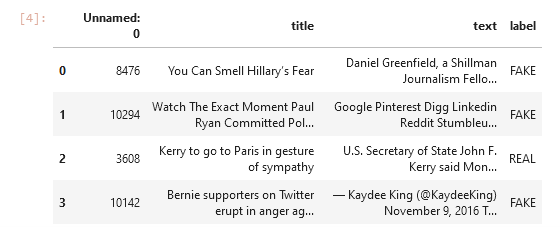

# Detecting Fake News Application

Fake news encapsulates pieces of news that may be hoaxes and is generally 
spread through social media and other online media. This is often done to 
further or impose certain ideas and is often achieved with political agendas.
Such news items may contain false and/or exaggerated claims, and may end up 
being viralized by algorithms, and users may end up in a filter bubble.

## About the project

This advanced python project of detecting fake news deals with fake and real 
news. Using sklearn, we build a TfidfVectorizer on our dataset. Then, we 
initialize a PassiveAggressive Classifier and fit the model. In the end, the 
accuracy score and the confusion matrix tell us how well our model fares.

The dataset we’ll use for this python project- we’ll call it news.csv. This 
dataset has a shape of 7796×4. The first column identifies the news, the 
second and third are the title and text, and the fourth column has labels 
denoting whether the news is REAL or FAKE.

## Prerequisite

TODO: Write Prerequisite instructions

## Project Plan

- [ ] First step
