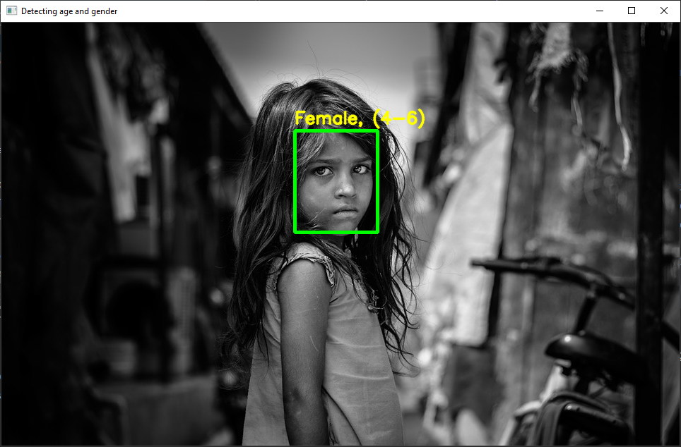

# Gender and Age Detection with OpenCV

The goal is to build a gender and age detector that can approximately guess the 
gender and age of the person (face) in a picture using Deep Learning on the 
Adience dataset.

## About the project

In this Python Project, we use Deep Learning to accurately identify the 
gender and age of a person from a single image of a face. We use the 
models trained by Tal Hassner and Gil Levi. The predicted gender may be one 
of ‘Male’ and ‘Female’, and the predicted age may be one of the following 
ranges- (0 – 2), (4 – 6), (8 – 12), (15 – 20), (25 – 32), (38 – 43), (48 – 
53), (60 – 100) (8 nodes in the final softmax layer). It is very difficult 
to accurately guess an exact age from a single image because of factors like 
makeup, lighting, obstructions, and facial expressions. And so, we make this 
a classification problem instead of making it one of regression.

### The CNN Architecture

The convolutional neural network for this python project has 3 convolutional 
layers:

    Convolutional layer; 96 nodes, kernel size 7
    Convolutional layer; 256 nodes, kernel size 5
    Convolutional layer; 384 nodes, kernel size 3

It has 2 fully connected layers, each with 512 nodes, and a final output 
layer of softmax type.

The final application of this python project is able to:

    Detect faces
    Classify into Male/Female
    Classify into one of the 8 age ranges
    Put the results on the image and display it

### The Dataset

For this python project, we’ll use the Adience dataset; the dataset is 
available in the public domain and you can find it here. This dataset serves 
as a benchmark for face photos and is inclusive of various real-world 
imaging conditions like noise, lighting, pose, and appearance. The images 
have been collected from Flickr albums and distributed under the Creative 
Commons (CC) license. It has a total of 26,580 photos of 2,284 subjects in 
eight age ranges (as mentioned above) and is about 1GB in size. The models 
we will use have been trained on this dataset.

## Prerequisite

To be able to run this system we need to install OpenCV (cv2), which can be 
done like that
    
    pip install opencv-python

Other packages needed are math and argparse, but those come as 
part of the standard Python library.

## Project Plan

- [x] Copy the code in main
- [x] Test a working version
