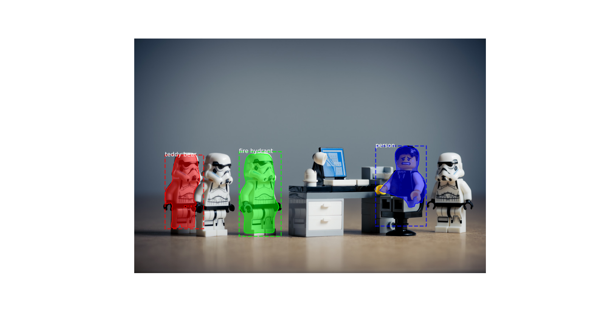

# Image Segmentation with Machine Learning

Object detection and image localization is a common problem of artificial  
intelligence systems. When there is a single object present in an image, we use 
image localization technique to draw a bounding box around that object. In the 
case of object detection, it provides labels along with the bounding boxes; 
hence we can predict the location as well as the class to which each object 
belongs.

**Fig.1.** *Mask R-CNN limitation with Star Wars Lego (a stormtrooper may be 
labeled as a teddy bear or a fire hydrant)*

Image segmentation results in more granular information about the shape of 
an image and thus an extension of the concept of Object Detection.

We segment, divide the images into regions of different colors which 
helps in distinguishing an object from the other at a finer level

### Semantic Segmentation

Semantic Segmentation is the process of segmenting the image pixels into 
their respective classes. For example, in the figure above, the cat is 
associated with yellow color; hence all the pixels related to the cat are 
colored yellow. Multiple objects of the same class are considered as a 
single entity and hence represented with the same color.

### Instance Segmentation

Instance segmentation is being more thorough and usually comes into picture 
when dealing with multiple objects. The difference here is, the detected 
object is masked with a color hence all the pixels associated with the image 
are given the same color. Multiple objects of the same class are treated as 
distinct entities and hence represented with different colors.

### Mask R-CNN

We are going to perform image segmentation using the Mask R-CNN architecture. It is an extension of the Faster R-CNN Model which is preferred for object detection tasks.

The Mask R-CNN returns the binary object mask in addition to class label and object bounding box. Mask R-CNN is good at pixel level segmentation.
How does Mask R-CNN work?

Mask R-CNN uses an architecture similar to its predecessor Faster R-CNN and also utilizes Fully Convolutional Network for pixel-wise segmentation.

#### 1. Feature Extraction

We utilize the ResNet 101 architecture to extract features from the input 
image. As a result, we get feature maps which are transmitted to Region 
Proposed Network.

#### 2. Region Proposed Network (RPN)

After obtaining the feature maps, bounding box candidates are determined and 
thus RPN extracts RoI (Region of Interest)

#### 3. RoI Pool

Faster R-CNN uses an RoI Pool layer to compute features from the obtained 
proposals in order to infer the class of the object and bounding box 
coordinates.

#### 4. RoI Align

RoI pool led to misalignments in getting the Region of Interest due to 
quantization of RoI coordinates. Since pixel-level segmentation required 
specificity hence authors of the Faster R-CNN cleverly solved it by 
implementing the RoI Align.

Masking is done by a small fully-connected network applied to each RoI, 
which predicts a segmentation mask in a pixel-to-pixel manner.

## About the project

TODO: Write a project description

## Prerequisite

Now, since we need certain libraries in order to make it, here is the list of
the libraries needed:

    numpy
    scipy
    pillow
    cython
    matplotlib
    scikit-image
    tensorflow
    keras
    opencv-python
    h5py
    imgaug
    ipython

## Project Plan

- [ ] Clone [Mask R-CNN Github Repository](https://github.com/matterport/Mask_RCNN.git)
- [ ] [Install Library Dependencies](#how-to-install-library-dependencies)
- [ ] Download [Pre Trained Weights](https://github.com/matterport/Mask_RCNN/releases/download/v2.0/mask_rcnn_coco.h5)
- [ ] Importing the libraries in the main code
- [ ] Code paths constants to dir/files of the project
- [ ] Create the inference function
- [ ] Code the prediction algorithm with the loaded model
- [ ] Adapt Mask R-CNN to our code base

## How to install library dependencies

First of all, from the ml-projects repository root create ml-projects anaconda 
environment using:

    conda env create -f environment.yml

Then, activate the environment and install Mask R-CNN from our fork (which 
has been modified to work with our system)

    conda activate ml-projects
    cd ~/git/Mask_RCNN
    python setup.py install 