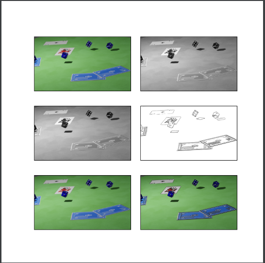

# Cartoonify an Image with OpenCV in Python

So today let’s head towards giving our pictures some cartoonic effects. This 
project is all about building a photo cartoonifyer using Python and OpenCV

Python is the pool of libraries. It has numerous libraries for real-world 
applications. One such library is OpenCV. OpenCV is a cross-platform library 
used for Computer Vision. It includes applications like video and image 
capturing and processing. It is majorly used in image transformation, object 
detection, face recognition, and many other stunning applications.

## About the project

With this project we aim to transform images into its cartoon. Yes,
we will CARTOONIFY the images. Thus, we will build a python application that 
will transform an image into its cartoon using OpenCV.

## Prerequisite

- CV2: Imported to use OpenCV for image processing
- easygui: Imported to open a file box. It allows us to select any file from 
  our system.
- Numpy: Images are stored and processed as numbers. These are taken as 
  arrays. We use NumPy to deal with arrays.
- Imageio: Used to read the file which is chosen by file box using a path.
- Matplotlib: This library is used for visualization and plotting. Thus, it 
  is imported to form the plot of images.
- OS: For OS interaction. Here, to read the path and save images to that path.

Code:
## Project Plan

Here is a checklist of the steps required to complete that project:

- [x] Importing the required modules
- [ ] Building a File Box to choose a particular file
- [ ] Store an image
- [ ] Transforming an image to grayscale
- [ ] Smoothening a grayscale image
- [ ] Retrieving the edges of an image
- [ ] Preparing a Mask Image
- [ ] Giving a Cartoon Effect
- [ ] Plotting all the transitions together
- [ ] Functionally of save button
- [ ] Making the main window
- [ ] Making the Cartoonify button in the main window
- [ ] Making a Save button in the main window
- [ ] Main function to build the tkinter window
