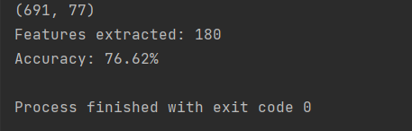

# PyListen: The Speech Emotion Recognition Application with librosa

Speech Emotion Recognition, abbreviated as SER, is the act of attempting to 
recognize human emotion and affective states from speech. This is 
capitalizing on the fact that voice often reflects underlying emotion 
through tone and pitch. This is also the phenomenon that animals like dogs 
and horses employ to be able to understand human emotion.

SER is tough because emotions are subjective and annotating audio is 
challenging.

## About the project

This goal of this project is to build a model to recognize emotion from speech 
using the librosa and sklearn libraries and the RAVDESS dataset.

In this Python project, we use the libraries librosa, soundfile, 
and sklearn (among others) to build a model using an MLPClassifier. This 
will be able to recognize emotion from sound files. We will load the data, 
extract features from it, then split the dataset into training and testing 
sets. Then, we’ll initialize an MLPClassifier and train the model. Finally, 
we’ll calculate the accuracy of our model.

### The Dataset

For this Python mini project, we use the RAVDESS dataset; this is the 
Ryerson Audio-Visual Database of Emotional Speech and Song dataset, and is 
free to download. This dataset has 7356 files rated by 247 individuals 10 
times on emotional validity, intensity, and genuineness. The entire dataset 
is 24.8GB from 24 actors, but we’ve lowered the sample rate on all the files.

## Prerequisite

You’ll need to install the following libraries with pip:

    pip install librosa soundfile numpy sklearn pyaudio

If you run into issues installing librosa with pip, you can try it with 
conda.

### About librosa

librosa is a Python library for analyzing audio and music. It has a flatter 
package layout, standardizes interfaces and names, backwards compatibility, 
modular functions, and readable code.

## Project Plan

- [x] Install the libraries
- [x] Code the project
- [x] Train the model
- [x] Validate the model
- [x] Document the code
