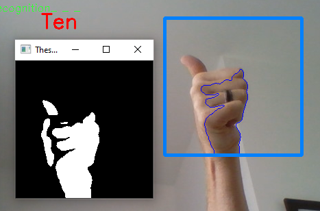
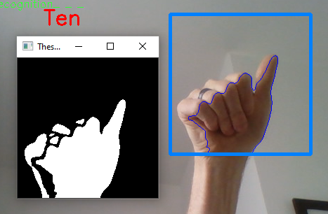
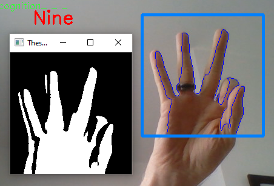
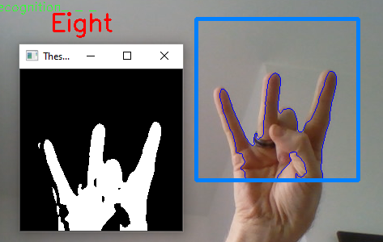
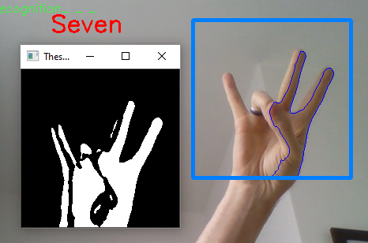
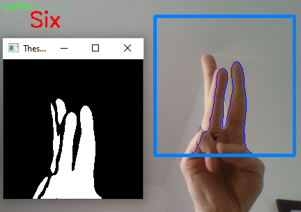

# The Sign Language Recognition with OpenCV

There have been several advancements in technologies, and a lot of research has 
been done to help the people who present disabilities. Aiding the cause, Deep 
learning, and computer vision can be used too to make an impact on this cause.

This can be very helpful for people who have in communicating with 
others as knowing sign language is not something that is common to all, 
moreover, this can be extended to creating automatic editors, where the 
person can easily write by just their hand gestures.

## About the project

In this sign language recognition project, we create a sign detector, which 
detects numbers from 1 to 10 that can very easily be extended to cover a 
vast multitude of other signs and hand gestures including the alphabets.

We have developed this project using OpenCV and Keras modules of python.

## Prerequisite

The prerequisites software & libraries for the sign gesture language project 
are:

    Python (3.9.0)
    IDE (Pycharms)
    Numpy (version 1.19.2)
    OpenCV (version 4.5.1.48)
    Keras (version 2.4.3)
    Tensorflow (version 2.5.0rc1)

## Project Plan

- [x] Code the project
- [x] Create the dataset
- [x] Train a CNN on the captured dataset
- [x] Predict the data
- [x] Test the code
- [x] Document the project
