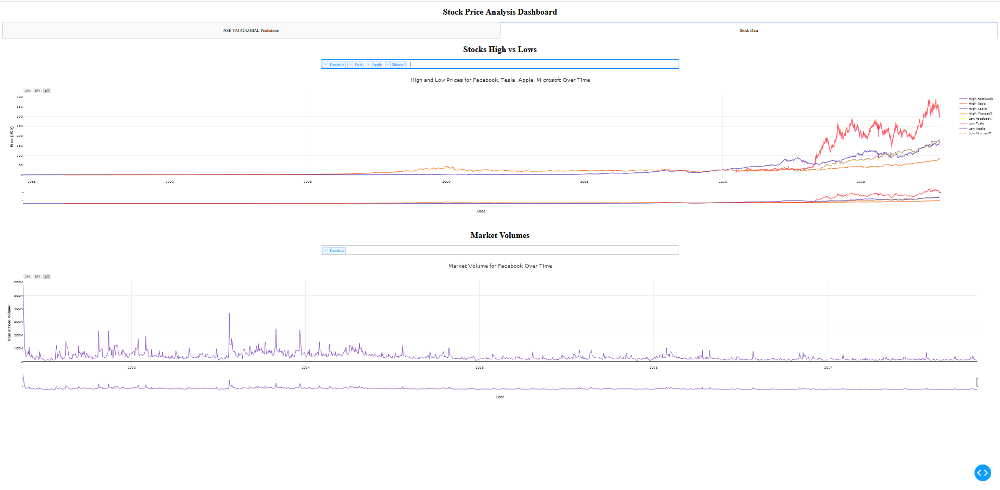

# Stock Price Prediction Application

Machine learning has significant applications in the stock price prediction. In this machine learning project, we will be talking about predicting the returns on stocks. This is a very complex task and has uncertainties. We will develop this project into two parts:
- First, we will learn how to predict stock price using the LSTM neural network.
- Then we will build a dashboard using Plotly dash for stock analysis.

## About the project

Datasets

- To build the stock price prediction model, we will use the NSE TATA GLOBAL 
  dataset. This is a dataset of Tata Beverages from Tata Global Beverages 
  Limited, National Stock Exchange of India: Tata Global Dataset
- To develop the dashboard for stock analysis we will use another stock 
  dataset with multiple stocks like Apple, Microsoft, Facebook: Stocks Dataset

## Prerequisite

The interesting Python project requires you to have basic knowledge of 
Python programming, deep learning with Keras library. Also dash and 
plotly library for building the frontend through a webapp.

We need to install those necessary libraries for this project:
- Numpy, Pandas - for data processing
- TensorFlow - for NN modeling (with LSTM)
- Keras - for DNN modeling
- Matplotlib, Dash, Plotly - For plotting results

using this command:
    pip install numpy, pandas, tensorflow, keras, dash, plotly

## Project Plan

- [x] Code model
- [x] Code Dashboard
- [x] Cleanup and document model
